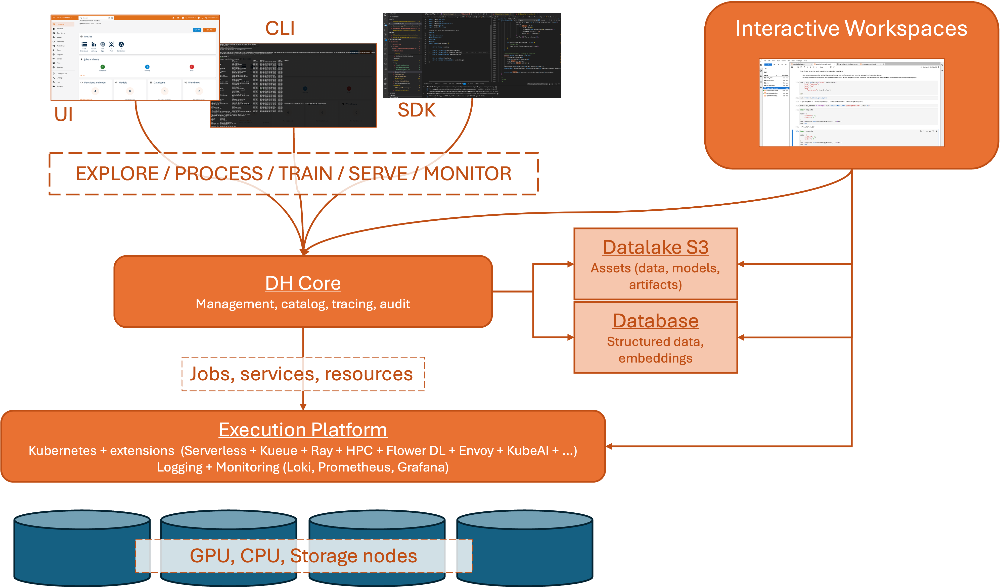

# ATLAS Architecture

The ATLAS Cluster is build upon HW resources from old ATLAS and ABACUS clusters of DIGIS/AI and DHW centers respectively. It integrates the following types of infrastructure made available to the research units:

- different types of GPU nodes (including V100, A40, L40, H100, H200, A5000, A6000 PRO, etc);
- CPU nodes
- storage infrastructure

Please note that currently the state of new unified ATLAS architecture is under development; new nodes are gradually added to the cluster. It is expected to complete the fusion of all the infrastructure by the end of 2026. See the details about migration plan and roadmap in the [Migration Plan](./migration_roadmap.md) section.

The logical architecture of the ATLAS Cluster is shown in the figure below:

The architecture relies on the following building blocks:

- **Execution Platform**, that takes care of running jobs, deploying supporting services and apps, run interactive workspaces. The platform relies on 
  [Kubernetes](https://kubernetes.io/) for the resource and workload management, and is extended with necessary instruments for scheduling and queueing. The execution platform is deployed on top of the HW resources of the integrated ATLAS and ABACUS cluster.
- **Persistent Data Storage** implemented with S3-compatible Datalake and a relational Database ([PostgreSQL](https://www.postgresql.org/)) and its extensions (spatial data, vector storage). All the relevant data managed by the research units should be stored here.
- **Interactive Workspaces** that allow to create and run interactive sessions (e.g., JupyterLab, VSCode). The interactive workspaces are deployed on top of the same HW resources and managed by the execution platform.
- **Management Layer** (DH Core) that provides the necessary interface to launch and monitor the jobs and services in the execution platform. Together with other supporing components, the management layer forms a complete AI / MLOps platform for the development of AI applications. As such it also includes such functionality as the catalog of datasets, models and artifacts, support for experiments tracking, low-code/no-code development, etc. The interactions with the management layer may be performed through the web interface, the command line interface (CLI), or the dedicated Python SDK.

## Organization

The logical architecture is instantiated as a multi-tenant environment, where **each research unit has a dedicated and isolated platform instance**. More specifically, each tenant

- has its own isolated storage space;
- has its own isolated management layer;
- manages its own interactive workspaces, services and jobs within a dedicated execution platform namespace;
- has its own set of users corresponding to the research unit members.

The execution resources are shared between all tenants. The usage of resources is limited by the quota assigned to each tenant. See [Resources and Quotas](./resources.md) for details on how the quotas are managed, how the resources are assigned and how the jobs are scheduled within the execution platform.

When accessisng the components of the platform (either through the WEB interfaces, CLI or SDK), the users are authenticated using the FBK login credentials. The access to the datalake is based on personal session token credentials emitted by the management layer. The database storage is not available outside the cluster. The interactive workspaces are also personal and are connected to the management layer and storages automatically.

The endpoints of the tenant platform components are available through the `https://*.<tenant>.atlas.fbk.eu` domain, for example:

- Management layer UI: `https://core.<tenant>.atlas.fbk.eu`
- Interactive workspace manager: `https://coder.<tenant>.atlas.fbk.eu`

The name of the tenant corresponds to the research unit name.

Please note that the cluster is available only within the FBK network. To access the cluster outside of this network, it is necessary to access it via a VPN connection. See a [dedicated FBK HowTo](https://howto.fbk.eu/documenti/zero-trust-vpn/) section on this topic.

## Functionality and Operations

The goal of the platform is to support the development and execution of the computation intensive AI solutions and experiments, ranging from data processing and analysis to model training, to inference, and to prototyping complex ML/AI applications (e.g., RAG applications, inference services, etc). Given its functionality the platform users can perform the following operations.

### Interactive Workspaces

It is possible to create and run **interactive sessions** directly on top of the execution platform using its resources. Specifically, the users can create one or more **personal** interactive workspaces that are instantiated on top of the HW resources of the execution platform. Once configured and started, the users can access the interactive workspaces through the JupyterLab interface, VS Code Web interface, or from the VS Code environment on own PC using the corresponding integration support.

The interactive workspaces are automatically connected to the other components of the platform: they have the personal user credentials to access the management layer and the data storage. The users can configure the workspace resources (disk size, memory, CPU or even GPU usage), within the quotes associated to the tenant they belong to. 

The workspaces may be started and stopped by the users at any time. The workspace storage is isolated and persistent. However, theno backup is performed so do not rely on it for the critical data persistence.

!!! note
    While it is possible to assign significant resource amount to workspaces and even associate basic GPUs to it, please note that the resources are shared between all tenants and the usage is limited by the quota assigned to each tenant. See [Resources and Quotas](./resources.md) for more details.

###  Computation-intensive Jobs

A typical and the most common scenario is to use the cluster to run research experiments that require specific hardware resources (e.g., memory, GPU, etc). As it was happening in the old cluster, such experiments are represented as a Job (represented e.g., as a Docker comtainer) that the user launches on the execution platform to perform some model training, batch processing, benchmarking, etc.

There are some significant changes with respect to the old modality of using the clusters:

- The execution of a job is not triggered directly by the user, but is intermediated by the management layer. In fact, the users of the platform **never** access the HW resources directly. Instead, using the management layer it is necessary to provide the declarative specification of the executable (e.g., container to be executed) and the execution configuration, such as execution parameters/arguments, the resources to be associated, etc. The management layer will prepare the job and schedule it on the execution platform passing the necessary information. The management layer and its interfaces may be used to monitor the execution, see the execution log, resource consumption, and status.
- Each job starts from scratch, with **empty storage space**. When the job completes, the resources are released and the storage is cleared. This means that, if the job uses some data or produces some output, it is responsability of the user to include the neccessary instruction to get the data (e.g., from Datalake) and to store the output upon completion (e.g., to Datalake). 
- The underlying containers are executed **without root privileges**. Any container with root privileges will be automatically blocked. 
- The underlying container images should be available to the cluster. It is possible to use public image registries (e.g., Docker Hub or GitHub) or to upload custom images to the cluster **internal container registry**.
- Each execution is associated to a user who has requested it, and therefore to the corresponding research unit. Besides audit aspects, this information is useful for the resource utilization and budget aspects.

!!! note
  While it is possible to run an arbitrary container in this way, the provided AI platform provides support for common types of executables, such as Python-based jobs. See thr [Platform Documentation](https://scc-digitalhub.github.io/docs/) for more details.

### Services

It is also possible to deploy and execute **services** on the platform. This includes, e.g., inference services, APIs, LLM models and supporting tools like embedding ranking etc. Differently from jobs, the services run and are exposed permanently, until not stopped explicitly. As in case of jobs, the same restrictions apply: non-root execution, empty ephimeral storage, etc. 

Once deployed, the services are exposed within the unit namespace on a (predefined or user-specified) ports and are ready to serve the HTTP/TCP traffic. 

!!! note
  As in case of jobs, the AI platform provides support not only the possibility to deploy an arbitrary container, but also for common types of services, such as Python-based Serverless functions, LLMs compatible with OpenAI API, MLFlow model serving, etc. See thr [Platform Documentation](https://scc-digitalhub.github.io/docs/) for more details.

### Data Management

The storage infrastructure enabled is tightly integrated with the computing nodes and allows for managing both structured and unstructured datasets. The access to the data is based on credentials managed by the management layer. The credentials are temporal and are personal; currently no permanent and/or shared credentials are supported. When working outside the platform, the credentials may be obtained with the management [CLI](https://scc-digitalhub.github.io/docs/0.15/cli/installation/). When working in the platform the credentials are injected automatically in the corresponding context (e.g., workspace, job, service).

While it is possible to use the persistent datastorage directly using the corresponding SDKs or tools, the management layer of the AI platform and the corresponding clients (Web, CLI, SDK) provide support for more advanced data management operations that include
- Data / artifact / Model catalog
- Versioning and metadata support with additional extra information (e.g., table schemas, previews, metrics, etc)
- More efficient data storage
- Transparent and easy to use APIs for registering, accessing, and managing the data artifacts. 

